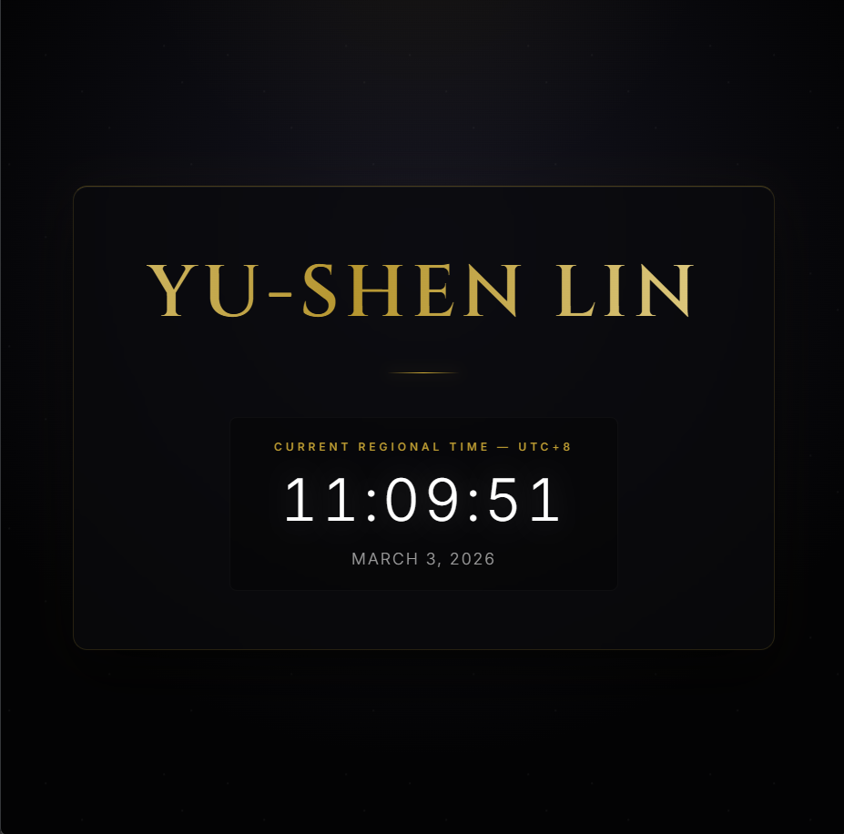

# Yu-Shen Lin - Personal Webpage

Welcome to the source code for my personal webpage! This project is a visually striking, premium-feeling static website inspired by theatrical aesthetics and designed to leave a strong first impression.

## 👁️ Live Preview
**You can view the live deployed webpage here:**
👉 [https://wilson052755.github.io/L1-PersonalPage/](https://wilson052755.github.io/L1-PersonalPage/)

### Screenshot


## 🌟 Project Overview

This webpage features a deep, atmospheric design with elegant typography and subtle, engaging animations. It serves as a digital business card that prominently displays my name alongside a real-time, accurately calculated UTC+8 regional clock.

### Key Features
- **Theatrical Aesthetics**: A dark, immersive background mimicking stage lighting (`radial-gradient` glow) and subtle starry/dust particle animations.
- **Premium Typography**: Uses the classic serif font `Cinzel` for the central name display, complemented by a flowing golden gradient text effect.
- **Glassmorphism UI**: The main content is housed in a frosted glass card, blending into the atmospheric background while maintaining high readability.
- **Live Regional Clock**: A JavaScript-powered digital clock that consistently calculates and displays the time and date in the UTC+8 timezone, regardless of the user's local system time.

## 📁 File Structure

```text
L1-PersonalPage/
├── index.html     # The main HTML structure, including font loading and DOM semantic elements.
├── styles.css     # All styling rules, CSS variables for theming, and keyframe animations.
├── script.js      # JavaScript logic handling the real-time UTC+8 clock and date calculations.
├── preview.png    # Preview screenshot of the webpage UI.
└── README.md      # This documentation file.
```

## 🚀 Getting Started

If you want to view the webpage locally rather than using the live link:
1. Clone the repository: `git clone https://github.com/wilson052755/L1-PersonalPage.git`
2. Open the directory and simply double-click on `index.html` to open it in any modern web browser.
3. No build tools or dev servers are required for this static version!

## 🎨 Design System

- **Primary Colors**: Dark theatrical background (`#030304` to `#151520`)
- **Accent Colors**: Elegant Golds (`#d4af37`, `#f3e5ab`, `#b5952f`)
- **Fonts**: `Cinzel` (Headings), `Inter` (Body & Clock Data)

## 👤 Author
**Yu-Shen Lin**
